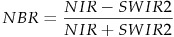
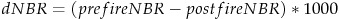
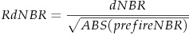

# A brief primer on Google Earth Engine

Lab meeting 2019-05-13

## Resources

There are many good workshops and tutorials, for example:

- [Software carpentry-style tutorial](https://geohackweek.github.io/GoogleEarthEngine/)
- [US-IALE workshop by NASA DEVELOP](https://github.com/fortCollinDev/modelingShortCourse)
- [Earth Engine 101 by GEE](https://docs.google.com/document/d/1ZxRKMie8dfTvBmUNOO0TFMkd7ELGWf3WjX0JvESZdOE/edit#heading=h.410q8l7bcr6j)

When you are comfortable with the basics, explore the [Google Earth Engine API](https://developers.google.com/earth-engine/).

## Lab meeting prep

- Bring your personal computer, so you can follow along and experiment with the code editor.
- Create a Google Earth Engine account. [Sign up here.](https://signup.earthengine.google.com/#!/)

## Why Google Earth Engine

- Free and powerful cloud computing
- Massive online public data archive, no download needed
- Upload your own data
- Built-in version control, collaborative environment
- Lots of documentation and example code, active user community
- Living platform: new datasets, build add interface for end users, etc.

## Some caveats

- Learning curve
  - Uses Javascript, with own set of classes, functions
  - Can use Python with additional steps
- Import and export can be slow
- Limited number of built-in algorithms
- Not for cartography

## Introduction to code editor window

The main interaction with GEE is through the [code editor](https://code.earthengine.google.com/).


Code editor window in the middle:

- Write code here
- Save and run code
- Some built-in assistance, debugging

Left window:

- Saved scripts
- Quick reference for API documentation
- Upload and access own data

Right window:

- Console output, can use `print();` to send to console
- Inspector (like identify), give information about point location on map
- Tasks to check on progress
- Profiler has information on resource use for computation (useful for benchmarking or troubleshooting)

Search bar on top, one way to import data.

Map on bottom, will look at as we go.

[Click here for a comprehensive overview of the code editor window.](https://developers.google.com/earth-engine/playground#api-reference-docs-tab)

## Case study: Calculating fire severity

### Goal

For this exercise, my goal is to generate a fire severity map for the 2016 Berry
Fire in Grand Teton National Park using Landsat.

### Getting started with a script

First, start with a blank script.

```javascript
/**
* A brief primer on Google Earth Engine
* Lab meeting 2019-05-13
*/
```

Save your script.

### Step 1: Determine my area of interest

Different options for doing this:

- Draw a shape
  - Example: rectangle tool, auto-imports geometry
- Import shapefile
  - Example: Berry Fire perimeter, zipped shapefile
  - Go to assets tab to import it
- Identify Landsat tile that covers area of interest,
  here path 38, row 29.

Let's import the Berry Fire perimeter and rename it
`berry_fire`.

### Step 2: Import prefire data

We want to import `USGS Landsat 8 Surface Reflectance Tier 1`.

- Quick search: use search bar at top. Search, look at metadata, and import
  all through this search bar.
  - Automatically creates variable `imageCollection` with access to entire dataset.
  - Can rename this variable by clicking on it.
  - This can now be called from the script.
- Alternatively, browse the [Earth Engine Data Catalog](https://developers.google.com/earth-engine/datasets/).
  - Commonly used datasets like Landsat have own header link.
  - Navigate to Landsat 8 Surface Reflectance Tier 1.
  - Also has metadata, a little more user-friendly.
  - Description includes example code.
  - Need to know about bands for visualization.
  - Image properties for filtering.
  - We are going to take and modify some of this example code.

```javascript
/**
* Import prefire data
*/

/**
 * Function to mask clouds based on the pixel_qa band of Landsat 8 SR data.
 * @param {ee.Image} image input Landsat 8 SR image
 * @return {ee.Image} cloudmasked Landsat 8 image
 */
function maskL8sr(image) {
  // Bits 3 and 5 are cloud shadow and cloud, respectively.
  var cloudShadowBitMask = (1 << 3);
  var cloudsBitMask = (1 << 5);
  // Get the pixel QA band.
  var qa = image.select('pixel_qa');
  // Both flags should be set to zero, indicating clear conditions.
  var mask = qa.bitwiseAnd(cloudShadowBitMask).eq(0)
                 .and(qa.bitwiseAnd(cloudsBitMask).eq(0));
  return image.updateMask(mask);
}

var LS8_SR2016 = ee.ImageCollection('LANDSAT/LC08/C01/T1_SR')
  // Start date of Berry was July 25, 2016
  .filterDate('2016-07-01', '2016-07-24')
  // Path and row of Landsat tile of interest
  .filter(ee.Filter.eq('WRS_PATH', 38))
  .filter(ee.Filter.eq('WRS_ROW', 29))
  // Find image with minimal cloud cover
  .filterMetadata('CLOUD_COVER', 'less_than', 20)
  // Use provided mask function
  .map(maskL8sr);

// Print metadata to console
print(LS8_SR2016);
```

Visualize data to check that we downloaded what we expected.

```javascript
// Subset image collection to one image
var prefire = LS8_SR2016
  .first();

/**
 * Visualization:
 * Can be preconfigured, find existing code in API
 * or other sources.
 * Can also be configured after adding the layer
 */
 
//true color
var visParams = {
  bands: ['B4', 'B3', 'B2'],
  min: 0,
  max: 3000,
  gamma: 1.4,
};

//color infrared
var cirParams = {
  bands: ['B5', 'B4', 'B3'],
  min: 0,
  max: 3000,
  gamma: 1.4,
};

//navigate to desired location in map
Map.setCenter(-110.7, 44.0, 10);

//layers added in order, cannot be moved around
// image name, visualization parameters, layer name, display on run
Map.addLayer(prefire, visParams, 'vis_2016',false);
Map.addLayer(prefire, cirParams, 'cir_2016',false);
Map.addLayer(berry_fire, {color: '000000'}, 'Berry_fire',false);
```

When this code is run, `Layers` pops up.

- Use of `false` means layer not automatically displayed,
  can be time saver.
- Can change display within layer settings options.

### Step 3: Import postfire data

We want to image date to be as close to one year difference
as possible.

```javascript
/**
* Import postfire data
*/

var LS8_SR2017 = ee.ImageCollection('LANDSAT/LC08/C01/T1_SR')
  // Same filter dates plus 1 yr
  .filterDate('2017-07-01', '2017-07-24')
  .filter(ee.Filter.eq('WRS_PATH', 38))
  .filter(ee.Filter.eq('WRS_ROW', 29))
  .filterMetadata('CLOUD_COVER', 'less_than', 20)
  .map(maskL8sr);

// Print metadata to console
print(LS8_SR2017);
```

This returns two images. You can navigate metadata to find the one
with the closest data, or you can do some googling to find
a function that someone's already created to simplify this
proces.

```javascript
// or: Year-Month-Day Extract function
function ymdList(imgcol){
    var iter_func = function(image, newlist){
        var date = ee.Number.parse(image.date().format("YYYYMMdd"));
        newlist = ee.List(newlist);
        return ee.List(newlist.add(date).sort())
    };
    return imgcol.iterate(iter_func, ee.List([]));
}

print(ymdList(LS8_SR2016))
print(ymdList(LS8_SR2017))
```

We will use the `20170722` image.

```javascript
/** 
* Filter and visualize postfire
*/

var postfire = LS8_SR2017
  .filterDate('2017-07-21','2017-07-23')
  .first();

Map.addLayer(postfire, visParams, 'vis_2017',false);
Map.addLayer(postfire, cirParams, 'cir_2017',false);
```

Note that layers are added in order and cannot be moved.

Check to see that satellite images give good view of
majority of fire perimeter.

### Step 4: Calculate RdNBR

Note that some metrics, like NDVI, are already calculated
and provided as derived datasets in Google Earth Engine, often
with a lot of different options (like 8-day, 32-day, and
annual).

We are going to be calculating RdNBR by hand from these
two images.

Equations from [Miller et al. (2009)](https://www.fs.fed.us/postfirevegcondition/documents/publications/miller_etal_rse_2009.pdf)
and [Parks et al. (2018)](https://www.mdpi.com/2072-4292/10/6/879/htm).



Note: bands differ between [Landsat 7](https://developers.google.com/earth-engine/datasets/catalog/LANDSAT_LE07_C01_T1_SR) and [Landsat 8](https://developers.google.com/earth-engine/datasets/catalog/LANDSAT_LC08_C01_T1_SR).





```javascript
/**
* Calculate RdNBR
*/

// Extract bands of interest
var nir_2016 = prefire.select('B5');
var swir2_2016 = prefire.select('B7');

// Calc NBR
var nbr_2016 = (nir_2016.subtract(swir2_2016)).divide(nir_2016.add(swir2_2016))
  .rename('nbr_2016')
  .toFloat();

var nbr_2017 = postfire.normalizedDifference(['B5', 'B7'])
  .rename('nbr_2017')
  .toFloat();
  
// Calc dNBR
var dnbr_stack = nbr_2016.subtract(nbr_2017).multiply(1000)
  .rename('dnbr')
  .addBands(nbr_2016);

// calculate RdNBR  
var rdnbr = dnbr_stack.expression(
  "b('dnbr') / (sqrt(abs(b('nbr_2016'))))")
  .rename('rdnbr').toFloat();
```

Visualization approach: get information directly from image
for setting min and max.

```javascript
// Use the reducer to get the mean and SD of the image.
var minMax = ee.Number(rdnbr.reduceRegion({
  reducer: ee.Reducer.minMax(),
  bestEffort: true,
}));

print(minMax); // not very helpful
```

Approach 2: use prior knowledge.
The min and max here were used after scanning
Parks et al. (2018).

```javascript
// used numbers typically reported in papers
Map.addLayer(rdnbr.unmask(-9999), {min: -500, max: 1500,
  //Color Brewer palette plus black for masked areas
  palette: ['black','2c7bb6','abd9e9','ffffbf','fdae61','d7191c']}, 
  'rdnbr', true);
```

### Additional notes

- Can use filter for just fire perimeter(s)
- See Google Earth
  Engine code from Parks et al. (2018): [link](https://code.earthengine.google.com/c76157be827be2f24570df50cca427e9)
- Many cool datasets to consider, such as:
  - [Sentinel 2](https://developers.google.com/earth-engine/datasets/catalog/COPERNICUS_S2):
     5-day revisit frequnecy between 2 satellites,
     visible bands and NIR at 10 m resolution,
     other bands such as SWIR at 20 m resolution
  - [NAIP](https://developers.google.com/earth-engine/datasets/catalog/USDA_NAIP_DOQQ):
  High resolution aerial imagery (typically 1 m)
  acquired on 3- or 5-year cycle. Recent imagery includes
  NIR in addition to visible bands.
